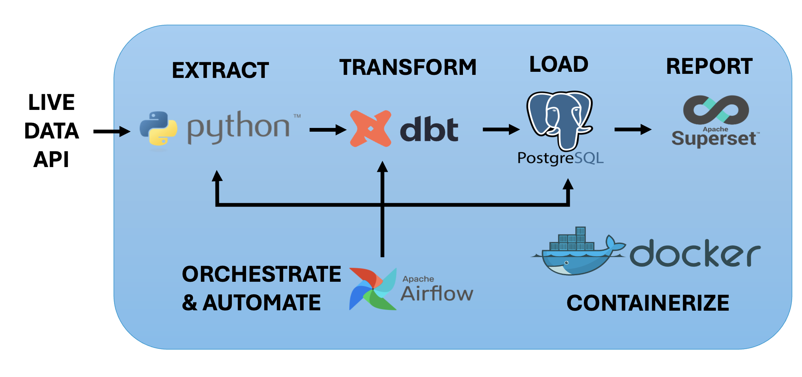
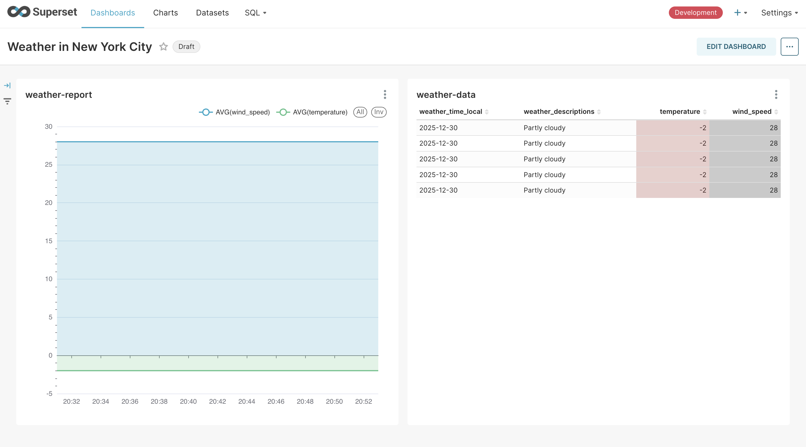

## Real-Time Weather Data Pipeline Architecture



The pipeline follows ELT (Extract, Load, Transform) architecture with a layered data warehouse approach:

1. **Extract**: Python scripts fetch real-time weather data from external API
2. **Load**: Raw data is stored in the `raw_weather_data` table in PostgreSQL
3. **Transform**: dbt models process the data through multiple layers:
   - **Staging Layer**: `stg_weather_data` - cleaned and standardized data
   - **Mart Layer**: 
     - `weather_report` - comprehensive weather metrics
     - `daily_average` - aggregated daily statistics
4. **Report**: Apache Superset queries the mart tables for visualization
5. **Orchestrate**: Apache Airflow schedules and automates the entire pipeline
6. **Containerize**: Docker ensures consistent deployment across environments

### Data Flow
```
Weather API -> raw_weather_data -> stg_weather_data -> weather_report -> Superset Dashboard
                                                       daily_average
                                                   
```

## Superset Weather Report


